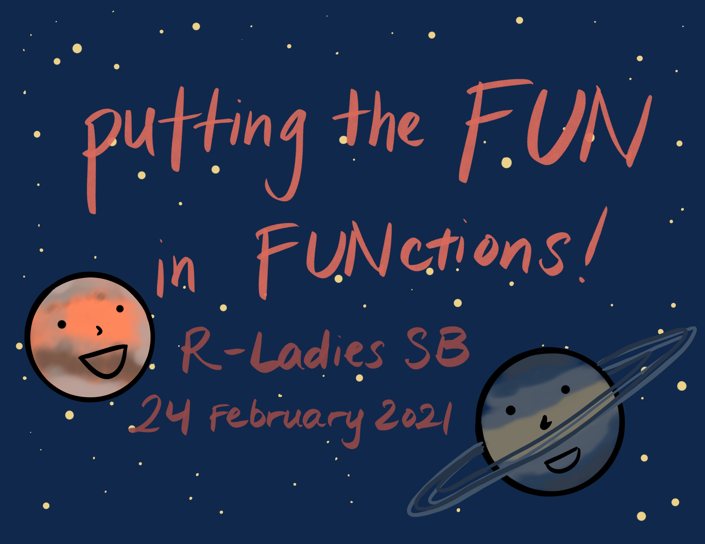

# Putting the fun in FUNctions

Written for R-Ladies SB workshop on 24 February 2021. The knitted html document is published on [RPubs](https://rpubs.com/an-bui/fun-functions).  

## Files

- `key-FUNctions.Rmd`: all activities filled in
- `template-FUNctions.Rmd`: no activities filled in

## `learnr` tutorial
There is also an accompanying [learnr tutorial](https://an-bui.shinyapps.io/FUNctions-learnR/)! The repository for that tutorial is [here](https://github.com/an-bui/learnr-functions).    

