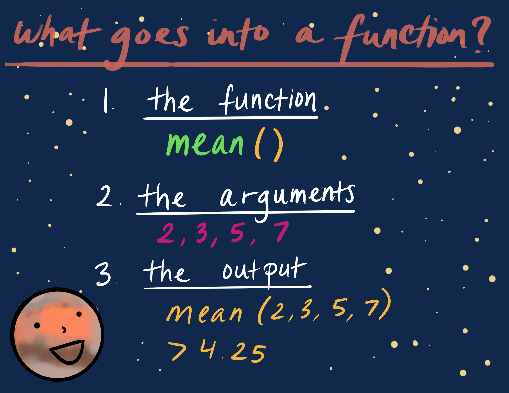

```{r setup, include=FALSE}
library(tidyverse)
knitr::opts_chunk$set(echo = TRUE)
```

This script was adapted from [Tanya Rogers](https://outsidethequadrat.weebly.com/), who adapted it from Umi Hoshijima, who adapted it from [Software Carpentry](https://swcarpentry.github.io/r-novice-inflammation/02-func-R/index.html)!  

This is a short tutorial on writing functions in R by An Bui with help from Juliette Verstaen and Sam Csik.

# 1. What do functions do?

**Functions** allow you to 'do' things in R. There are 3 basic parts to handling a function:

```{r, out.width = "400px", fig.align = "center", echo = FALSE}

```

1. the function: this is the operation you're using  
2. the arguments: these go into the function  
3. the output: the result of using the function  

For example:  

- `mean()` is a function that lets you **take the mean** of the input.  

```{r}
# making some data
dat <- c(3, 5, 6, 9)

mean(dat)
```

- `plot()` is a function that allows you to **make a plot**, and the arguments lets you customize that plot.  

```{r out.width = "400px", fig.align = "center"}
# making some fake data to put into the plot
yaxis <- sqrt(dat) + 3

plot(x = dat, y = yaxis)
```

# 2. Writing your own functions

Sometimes R doesn't have the function you want. That's ok, because you can write your own! The function called `function()` lets you write a function. The basic structure reflects function components: 

```{r, out.width = "400px", fig.align = "center", echo = FALSE}
knitr::include_graphics("figures/function-structure.jpg")
```

```{r eval = FALSE}
my.function <- function(arguments) {
  output <- something(arguments)
  return(output)
}
```

Let's put that into practice by writing a function to convert temperature values!  

The US uses fahrenheit, bleh. Let's convert that into celsius. The formula for converting fahrenheit into celsius is:  

$C = \frac{F-32}{1.8}$

And the formula for converting celsius into fahrenheit is:

$F = C*1.8 + 32$

We can write a function called `f_to_c` that converts fahrenheit to celsius.

```{r}

f_to_c <- function(x) {
  convert <- (x - 32)/1.8
  return(convert)
}

```

Yay! Now, we can see what 78 fahrenheit is in celsius.
```{r}
f_to_c(78)
```

## Formatting note

The curly brackets in functions are really important for making sure the function code actually works. You can save yourself a headache when you're writing a function if you immediately hit enter a bunch of times after opening up your brackets. After you're done writing your function, you can delete all the extraneous space. This ensures that you're not accidentally deleting your brackets!  

Try writing a function called `c_to_f` that converts celsius to fahrenheit! Remember, the formula is:

$C*1.8 + 32 = F$

```{r}

c_to_f <- function(x) {
  convert <- x*1.8 + 32
  return(convert)
}

```

And check to see if it works!
```{r}

c_to_f(36)

```


# 3. A bit fancier

Let's say that we want to convert between celsius and fahrenheit, but we don't want to have two separate functions for each. We can write a function that uses **conditionals**, which tell our code to execute different actions depending on whether a condition is true or false. To do so, we can incorporate `if()` or `if/else()` statements within our function.  

In order to wrap our heads around this, let's think of the functions we just wrote, `f_to_c()` and `c_to_f()`. We can put all of the components of those functions into one, and designate arguments for switching between each conversion. It's like compressing a bunch of different operations (the conversion) into one thing (the function), and calling the right conversion every time you wanted to use the function (by using the arguments).  

Here, we'll use the `function()` structure to make a function called `temp.conv` that converts between celsius and fahrenheit. Inside the function, we'll use `if()` statements to switch between all those conversion equations. The `if/else()` statement allows us to say:  
- **If** the inputs are celsius and fahrenheit, then use this conversion: $x*1.8 +32$. **else...**   
- **If** the inputs are fahrenheit and celsius, then use this conversion: $\frac{x-32}{1.8}$.  **else...**  
- **If** the inputs are neither fahrenheit or celsius, then return *NA* and give us a warning message to let us know something is wrong (this last step is optional, but can really help to troubleshoot problematic code).

```{r}

# arguments in: from, to, and the temperature
temp.conv <- function(from, to, x) {
  
  # if `from` is "celsius" and `to` is "fahrenheit", then
  if(from == "celsius" & to == "fahrenheit") {
    # convert from celsius to fahrenheit
    convert <- x*1.8 + 32
    
    # if `from` is "fahrenheit" and `to` is "celsius", then
    } else if(from == "fahrenheit" & to == "celsius") {
    # convert from fahrenheit to celsius
    convert <- (x - 32)/1.8
   
    # if inputs that don't match either of the first two conditionals are supplied, give warning and return NA 
    } else {
      warning("The inputs provided (from = '", from, "' & to = '", to,"') are not as expected. Double check spelling.")
      return(NA)
    }
  
  # return the converted value
  return(convert)
}
```

Let's try it out! I'll try converting 25 degrees celsius into fahrenheit.
```{r}
temp.conv(from = "celsius", to = "fahrenheit", x = 25)
```

What if we supply inputs that aren't "celsius" and "fahrenheit"?
```{r}
temp.conv(from = "c", to = "f", x = 25)
```

# 4. Different types of arguments

If you want to incorporate different types of arguments into your function, you can use the or operator: `||`
```{r}
# arguments in: from, to, and the temperature
temp.conv <- function(from, to, x) {
  
  # if `from` is "celsius" or "c", and `to` is "fahrenheit" or "f", then
  if(from == "celsius" || from == "c" & to == "fahrenheit" || to == "f") {
    # convert from celsius to fahrenheit
    convert <- x*1.8 + 32
    
    # if `from` is "fahrenheit" or "f", and `to` is "celsius" or "c", then
  } else if(from == "fahrenheit" || from == "f" & to == "celsius" || to == "c") {
    # convert from fahrenheit to celsius
    convert <- (x - 32)/1.8
 
    # if `from` and `to` don't match any of the expected inputs, give warning and return NA 
   } else {
      warning("The inputs provided (from = '", from, "' & to = '", to,"') are not as expected. Double check spelling.")
      return(NA)
  }
  
  # return the converted value
  return(convert)
}
```

And now we can try the function with our new arguments:

```{r}
temp.conv(from = "f", to = "c", 100)
```

Now you're ready to write your own functions!

# 5. Writing practice

## Simple strings

Try writing a function called `planet_awesome()` that puts "is awesome!" after each planet name! We'll set up by making a vector of names of 4 planets:

```{r}
planets <- c("Mars", "Saturn", "Jupiter", "Mercury")
```

Try writing your function and seeing what the output is!

```{r}
planet_awesome <- function(x) {
  if(class(x) == "character") {
    awesome_statement <- paste(x, " is awesome!", sep = "")
    return(awesome_statement)
  } else {
    warning("Whoops! Wasn't expecting that. The inputs should be a character.")
    return(NA)
  }
}

# trying it out
planet_awesome(planets)
```

## Data cleaning

You can use functions to help streamline your workflow. Let's say we have some data on our planets:

```{r}
planet_data <- data.frame(
  planet = c("Mercury", "Venus", "Earth", "Mars", "Jupiter", "Saturn", "Uranus", "Neptune"),
  radius_km = c(2440, 6052, 6371, 3390, 69911, 58232, 25362, 24622),
  color = c("grey", "white", "blue", "red", "yellow", "yellow", "blue", "blue")
)

planet_data
```

Write a function that uses `dplyr::filter()` to filter planet observations by color and pull out the radius data for each color. Don't forget to check to see if your function works!

```{r}
color.pull <- function(data, color.choice) {
  if(color.choice %in% c("grey", "white", "blue", "red", "yellow") & 
     class(data) == "data.frame") {
    radius_vector <- data %>% 
      filter(color == color.choice) %>% 
      pull(radius_km)
    return(radius_vector)
  } else {
    warning("Whoops! Wasn't expecting that. Double check your inputs. Make sure that `data` is a data frame, and `color.choice` is grey, white, blue, red, or yellow.")
    return(NA)
  }
}

# trying it out
color.pull(planet_data, "blue")

# breaking it
color.pull(planet_data, "black")
```
